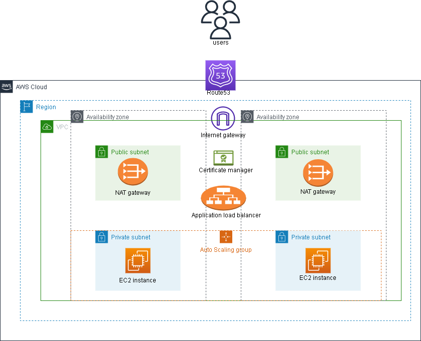

# Holiday Challenge
## Create two ec2 instances (use autoscaling if you like) in a logical network in private subnets, attach them to an application load balancer (and if you like attach the load balancer to route53)

The domain name is [sarahligbe.live](https://sarahligbe.live)   

Link to the [article](https://medium.com/@sarahligbe12/how-to-create-a-highly-available-aws-infrastructure-for-hosting-a-simple-web-app-using-ansible-fee5567e5c72)

  
(ideally there are supposed to be two NAT gateways to ensure high availability but I created only one because of billing)
### Pre-requisite
#### You should create an IAM role in your AWS account with 
* AmazonVPCFullAccess 
* AmazonEC2FullAccess 
* AmazonRoute53FullAccess and 
* AwsCertificateManagerFullAccess.  
This is because we need to full access these resources to be able to build everything in the architecture diagram. However, if you do not have a domain name then there's no need to give route53 and aws certificate manager access.

#### Attach the IAM role to the EC2 instance that will serve as the ansible control node (I used Ubuntu20.04).  
There's no need for an access key or secret key after attaching the IAM role.

#### You should also have the following packages installed
* Python3 >= 3.8.10  
* Ansible >= 2.12.0
* pip3 (in order to install the latest version of boto3)
* boto3 (my version is 1.26.43)
* unzip
* aws cli (this is because ansible does not have an acm module for requesting public certificates, hence the need for the cli).  
1. Python3 should already come with your ubuntu20.04 instance  
2. To install ansible  
``` bash
sudo apt update -y
sudo apt-add-repository ppa:ansible/ansible
sudo apt update
sudo apt install ansible
```
3. To install pip3  
``` bash
sudo apt -y install python3-pip
```
4. To install boto3
``` bash
sudo pip3 install boto3
```
You can upgrade boto3 by running
``` bash
sudo pip3 install boto3 --upgrade
```
5. To install unzip
``` bash
sudo apt -y install unzip
```
6. To install aws cli
``` bash
curl "https://awscli.amazonaws.com/awscli-exe-linux-x86_64.zip" -o "awscliv2.zip"
unzip awscliv2.zip
sudo ./aws/install
```
After successful installation, run
``` bash
aws configure
```
leave the **ACCESS key** and **SECRET key** fields blank, add your **aws region** and your preferred **output** format should be `json`.  

### To run the playbook
``` bash
ansible-playbook main.yml 
```
If you don't have a domain name, you should comment out the ***route53*** and ***ssl*** roles in the ***main.yml*** file.  
However if you own a domain name ensure you copy the nameservers that will be displayed after route53 is run to your domain provider, this is because ssl certificate from the Aws Certificate Manager may take longer to change from ***PENDING_VALIDATION*** to ***ISSUED*** because your nameservers have not been propagated.

#### If your ansible-core version is >= 2.14.0, use
`amazon.aws.autoscaling_group` for the auto scaling group in **roles/autoscaling/tasks/asg.yml** file

`amazon.aws.ec2_vpc_route_table` for the route table in **roles/provision_vpc/tasks/igw_rt.yml** && **roles/provision_vpc/tasks/nat_rt.yml** files

`amazon.aws.elb_application_lb` for the load balancer in **roles/load_balancer/tasks/alb.ym** file

`amazon.aws.route53_zone` && `amazon.aws.route53` for creating the route53 zone and the route53 record in **roles/route53/tasks/main.yml** file

This is a better practice according to ansible docs

#### Edit the host_vars/localhost/vars.yml to change the variables
